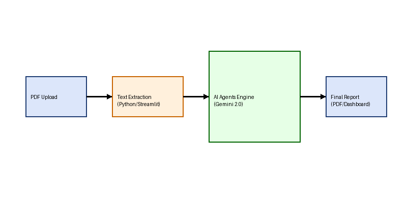
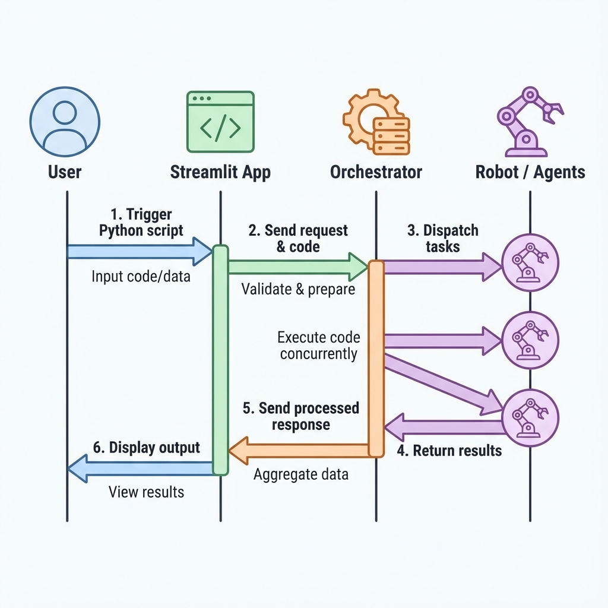
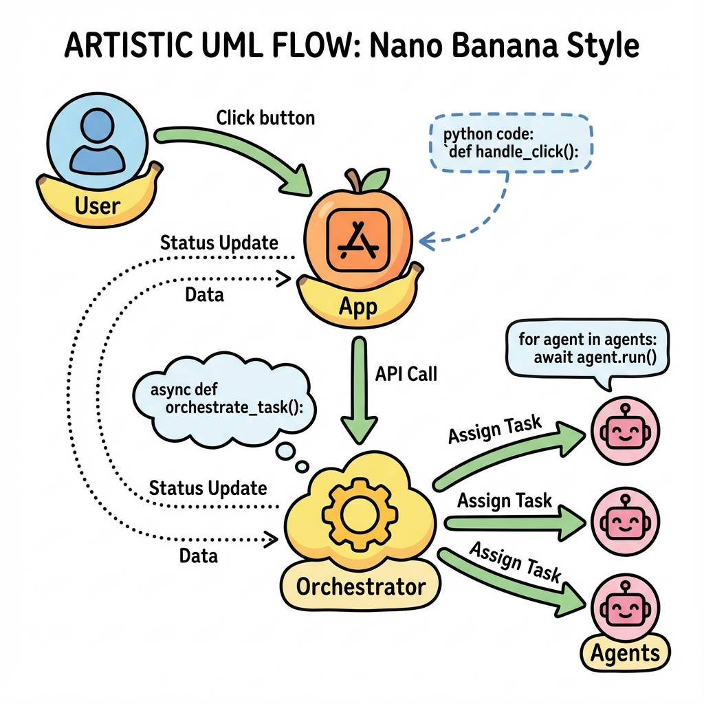

# Documento Técnico – Auditor de Orçamento com IA Generativa

Este documento detalha a arquitetura da aplicação, os fluxos de dados e os principais componentes de código que compõem o **Auditor Orçamento (SOF)**.

## Visão Geral
A solução é uma aplicação **Streamlit** que orquestra múltiplos agentes conectados ao **Google Gemini** para auditar documentos orçamentários (LOA, LDO, Notas Técnicas). O usuário fornece um PDF (upload ou exemplo), o texto é extraído e distribuído para agentes especialistas, e o resultado é consolidado em abas da interface. Abaixo segue a visão didática e uma versão detalhada da arquitetura, incluindo canais de dados e dependências.

## Arquitetura de Alto Nível

1. **Frontend (Streamlit)**: interface única (`app.py`) para upload, execução da auditoria e exibição tabulada dos achados.
2. **Orquestração**: `AuditorOrchestrator` paraleliza agentes de análise e depois aciona explicabilidade.
3. **Agentes Autônomos**: prompts especializados (Auditor, Compliance, Consistência e Explainability) que consomem a API do **Gemini**.
4. **Integração de Dados**: `utils/pdf_loader.py` extrai texto do PDF; os resultados são agregados e enviados à UI.

## Fluxo de Dados

1. **Entrada**: PDF carregado (upload ou mock) → `st.session_state.pdf_content`.
2. **Extração**: `extract_text_from_pdf` converte o PDF em texto bruto.
3. **Análise Paralela**: `AuditorOrchestrator.run_audit` executa `auditor.analyze_risks`, `compliance.verify_compliance` e `consistency.check_consistency` em threads.
4. **Explicabilidade**: `explainability.explain_findings` traduz achados técnicos em linguagem simples.
5. **Apresentação**: Abas de UI exibem riscos, conformidade, inconsistências e recomendações.

## Componentes de Código
### Interface (Streamlit)
Arquivo: `app.py`
- Configura página, estilos e sidebar para seleção de fonte (upload ou mock).
- Quando há PDF, exibe texto extraído em *expander* e aciona a auditoria no botão **"Executar Auditoria Inteligente"**.
- Cria quatro abas para mostrar riscos, conformidade, consistência e explicabilidade com tabelas, *containers* e *columns*.
- Valida `GEMINI_API_KEY` antes de orquestrar os agentes.

### Orquestrador de Agentes
Arquivo: `orchestrator.py`
- Classe `AuditorOrchestrator` com método `run_audit(text)`.
- Usa `ThreadPoolExecutor` para rodar em paralelo os três agentes analíticos (auditor, compliance, consistência) e, em seguida, envia o resumo consolidado para o agente de explicabilidade.
- Retorna um dicionário com todos os blocos de resultados para a UI.

### Agentes Especialistas (Gemini)
Arquivos em `agents/`
- **auditor.py** (`analyze_risks`): identifica riscos fiscais, impropriedades e gera parecer geral em JSON.
- **compliance.py** (`verify_compliance`): verifica aderência à LRF/CF, limites de gasto e metas fiscais, retornando itens de conformidade e resumo.
- **consistency.py** (`check_consistency`): procura inconsistências numéricas, lógicas ou textuais, com trechos de referência.
- **explainability.py** (`explain_findings`): converte achados técnicos em resumo executivo, pontos de atenção ao cidadão e recomendações ao gestor.
- Todos os agentes configuram a API do **Gemini** via `google.generativeai`, usam o modelo `gemini-2.0-flash` e retornam JSON (sanitizando *code fences* se presentes).

### Prompting e Normalização de Resposta
- Cada agente define *templates* de prompt em português com instruções claras de formato (listas ou JSON serializável) e limites de caracteres.
- Os retornos são pré-processados para remover *code fences* e eventuais quebras de JSON; quando parsing falha, a aplicação exibe mensagem de erro amigável e mantém o restante da experiência.
- O truncamento de entrada (`text[:30000]` ou `text[:10000]`) é aplicado antes do envio ao Gemini para evitar extrapolar janelas de contexto.

### Utilitário de PDF
Arquivo: `utils/pdf_loader.py`
- Função `extract_text_from_pdf(pdf_file)` usa `pypdf.PdfReader` para iterar páginas, concatenar texto e lidar com exceções básicas.

## Sequência de Execução no Frontend
1. **Bootstrap**: `load_dotenv()` carrega variáveis; `st.secrets` pode preencher `GEMINI_API_KEY` no Streamlit Cloud.
2. **Seleção de Arquivo**: `st.sidebar.radio` e `file_uploader` ou botão "Carregar Exemplo" (lê `examples/exemplo_orcamento.pdf`).
3. **Extração**: `extract_text_from_pdf` roda dentro de `st.expander` para visualização do texto cru.
4. **Auditoria**: botão aciona `AuditorOrchestrator().run_audit(text)` dentro de `st.spinner`; erros são capturados e exibidos via `st.error`.
5. **Renderização de Resultados**:
   - Tab Riscos: itera `results['auditor']['riscos']`, destaca gravidade por cor e mostra parecer geral.
   - Tab Compliance: converte itens em `DataFrame` e exibe tabela + resumo.
   - Tab Consistência: lista avisos com `st.warning` e `st.caption` com trecho de referência.
   - Tab Explicação: mostra resumo executivo, pontos de atenção (coluna 1) e recomendações (coluna 2).

## Ambiente e Configuração
- **Dependências**: definidas em `requirements.txt` (Streamlit, pypdf, python-dotenv, google-generativeai, pandas, etc.).
- **Credenciais**: variável `GEMINI_API_KEY` via `.env`, variável de ambiente ou `secrets.toml` no Streamlit Cloud.
- **Execução Local**: `streamlit run app.py` após instalar dependências e configurar a chave.

## Observabilidade e UX
- **Feedback em tempo de execução**: `st.spinner` indica o processamento das chamadas aos agentes; erros são apresentados em `st.error` com mensagens contextualizadas.
- **Layout Responsivo**: uso de `st.columns` e *expanders* para acomodar tabelas e textos longos; recomenda-se viewport >= 1280px para melhor legibilidade.
- **Screenshots disponíveis**: `screenshot_home.png` e `screenshot_results.png` ilustram o fluxo completo, úteis para suporte e treinamento.

## Considerações de Segurança e Limitações
- O texto enviado ao Gemini é truncado (`text[:30000]` ou `text[:10000]` no agente de explicabilidade) para caber na janela de contexto.
- Não há cache de resultados; cada execução chama a API.
- Não há persistência de dados sensíveis; credenciais vêm do ambiente e não são gravadas em disco pelo app.
- Tratamento de erros simples: se a chave estiver ausente ou a chamada falhar, cada agente retorna um dicionário com `error` e campos vazios.

## Diagramas Complementares
Além do fluxo de dados didático, o repositório inclui variações de arquitetura e diagramas de código que podem ser reutilizados em apresentações técnicas:

- `architecture_diagram.png`, `architecture_v2.png`, `architecture_v3.png`: alternativas visuais da arquitetura de agentes.
- `code_diagram.png`, `code_flow_didactic.png`: visão do encadeamento de módulos e chamadas.
- `dashboard_explainer.png`, `screenshot_home.png`, `screenshot_results.png`: capturas que ilustram a UI e o fluxo de uso.

Esses recursos podem ser incorporados em relatórios ou apresentações para stakeholders técnicos e não técnicos.
