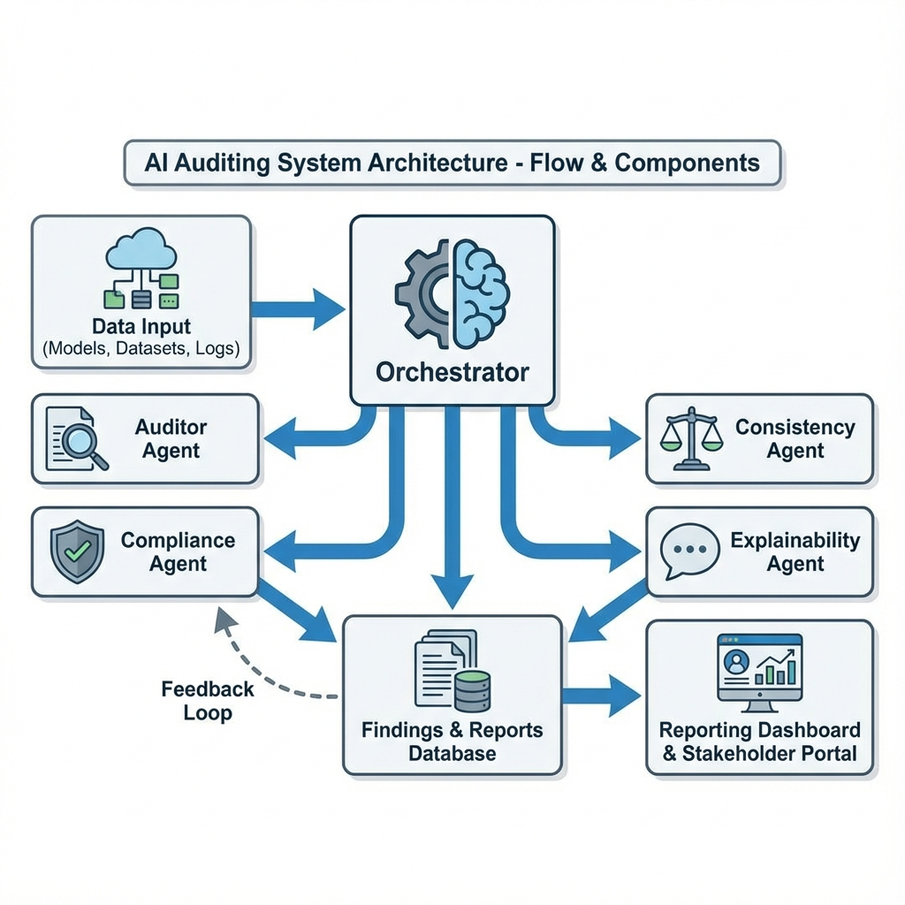
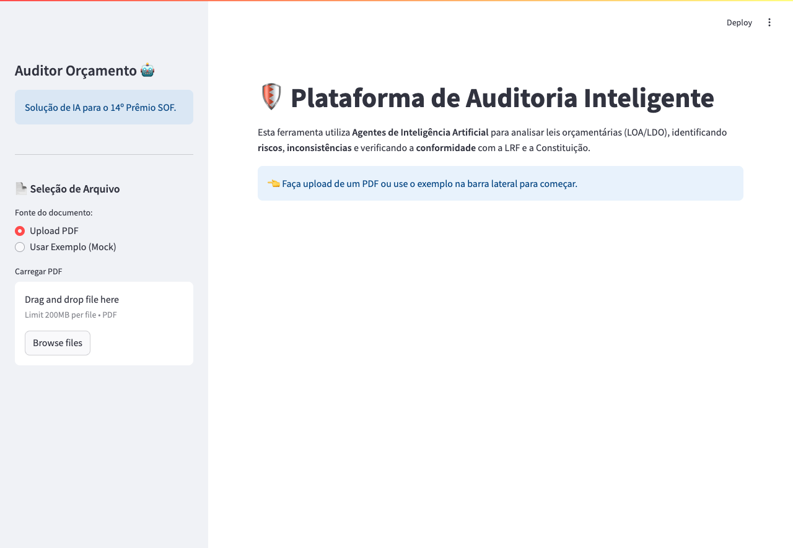
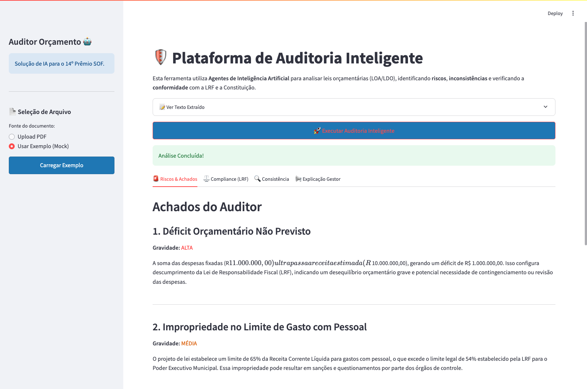

# 🛡️ Auditor de Orçamento com IA Generativa (SOF)

Este projeto apresenta uma plataforma funcional de auditoria de documentos orçamentários (LOA, LDO, Notas Técnicas) utilizando **Agentes de Inteligência Artificial** (Google Gemini).

O objetivo é aumentar a **transparência**, a **eficiência do gasto público** e empoderar auditores e cidadãos com uma ferramenta capaz de "ler" e analisar documentos complexos em segundos.

---

## 🏗️ Arquitetura

Para detalhes profundos sobre a implementação, consulte o **[Documento Técnico Completo](DOCUMENTO_TECNICO.md)**.


O sistema utiliza uma arquitetura de múltiplos agentes, orquestrada para simular uma equipe de auditoria:

1.  **AuditorAgent**: Focado em identificar riscos fiscais e contas que não fecham.
2.  **ComplianceAgent**: Verifica a aderência à LRF (Lei de Responsabilidade Fiscal) e Constituição.
4.  **ExplainabilityAgent**: Traduz os achados técnicos (economês) para linguagem clara.

### Diagrama Visual
O fluxo de trabalho foi desenhado para evitar alucinações de IA e garantir consistência:

1.  **Orchestrator**: Recebe o texto e decide quais agentes acionar.
2.  **Agentes Paralelos**: Auditoria, Compliance e Consistência rodam simultaneamente para performance.
3.  **Explainability**: Consolida os resultados técnicos em linguagem natural.

### Detalhamento Técnico
- **Frontend**: Streamlit (Python) - Interface limpa e reativa.
- **Backend AI**: Agentes autônomos consumindo Google Gemini 2.0 via API.
- **Arquitetura**: Micro-agentes independentes, cada um com *prompts* especializados (System Instructions).



## 🚀 Como Rodar Localmente

### Pré-requisitos
- Python 3.9+
- Uma chave de API do Google Gemini (`GEMINI_API_KEY`)

### Instalação

1. Clone o repositório:
```bash
git clone https://github.com/seu-usuario/auditor_orcamento.git
cd auditor_orcamento
```

2. Crie um ambiente virtual (recomendado):
```bash
python3 -m venv venv
source venv/bin/activate
```

3. Instale as dependências:
```bash
pip install -r requirements.txt
```

4. Configure a chave da API:
   - Crie um arquivo `.env` na raiz do projeto.
   - Adicione a linha: `GEMINI_API_KEY=sua_chave_aqui`
   - Ou exporte no terminal: `export GEMINI_API_KEY=sua_chave_aqui`

   **Alternativa (Streamlit Secrets):**
   - Crie um arquivo `.streamlit/secrets.toml` com o conteúdo:
     ```toml
     GEMINI_API_KEY = "sua_chave_aqui"
     ```

5. Gere o PDF de exemplo (Opcional):
```bash
python3 examples/generate_mock.py
```

6. Execute o aplicativo:
```bash
streamlit run app.py
```

## ☁️ Como Deployar no Streamlit Cloud (Recomendado para Banca)

1. Suba este código para o **GitHub**.
2. Crie uma conta no [Streamlit Cloud](https://streamlit.io/cloud).
3. Conecte seu GitHub e selecione o repositório.
4. Antes de clicar em "Deploy", vá em **Advanced Settings** -> **Secrets**.
5. Adicione sua chave lá:
   ```toml
   GEMINI_API_KEY = "sua_chave_do_google_aqui"
   ```
6. Clique em **Deploy**. O app estará online em minutos!

## 🖥️ Como Usar

1. Acesse `http://localhost:8501`.
2. Na barra lateral, escolha entre fazer **Upload** de um PDF seu ou usar o **Exemplo (Mock)**.
3. Clique em **"Carregar Exemplo"** (se escolheu o mock).
4. Clique no botão **"Executar Auditoria Inteligente"**.
5. Aguarde a análise e explore as abas de resultados.

## 🎥 Vídeo de Demonstração

Abaixo, os vídeos disponíveis para entender a solução:

- **[Tutorial de Uso (Demo)](https://github.com/naubergois/auditor_orcamento/raw/main/Comousar.mp4):** Demonstração prática da navegação e uso da ferramenta.
- **[Explicação Conceitual](https://github.com/naubergois/auditor_orcamento/raw/main/ExplicacaoAplicacao.mp4):** Detalhamento do funcionamento, arquitetura e impacto da solução.

### Interface da Aplicação

Abaixo, algumas capturas de tela da aplicação em funcionamento (geradas automaticamente via Selenium):

**Tela Inicial:**


**Resultados da Auditoria:**


## 🌐 Acesso à Aplicação

### Online (Streamlit Cloud)
A aplicação está disponível publicamente para testes e avaliação. 
**[Clique aqui para acessar o Auditor Orçamento](https://auditororcamento.streamlit.app)**
*(Caso o link esteja indisponível, verifique a seção de deploy abaixo ou entre em contato)*

### Localmente
Siga os passos de instalação abaixo para rodar em sua máquina.


## ⚠️ Limitações do Protótipo

- Esta versão é uma demonstração (MVP) focada na arquitetura de agentes.
- A análise depende da qualidade da extração de texto do PDF.
- A precisão das análises legais depende do contexto fornecido ao modelo (prompt engineering).
- Para uso em produção, recomenda-se fina sintonia (RAG - Retrieval Augmented Generation) com a base completa de leis.

### 🎓 Sobre o Autor

O autor do projeto é Doutor na área (ou qualificação relevante), reforçando a base científica da proposta.
- **[Visualizar Diploma de Doutorado](https://github.com/naubergois/auditor_orcamento/raw/main/4.DiplomaDoutorado.pdf)**

### 📂 Detalhamento da Apresentação
Abaixo, os módulos detalhados que compõem a apresentação do projeto:

- [01. Título da Solução](apresentacao/01_titulo_solucao.md)
- [02. Problema Orçamentário](apresentacao/02_problema_orcamentario.md)
- [03. Descrição da Solução](apresentacao/03_descricao_solucao.md)
- [04. Arquitetura](apresentacao/04_arquitetura.md)
- [05. Tecnologias Usadas](apresentacao/05_tecnologias_usadas.md)
- [06. Fluxo de Funcionamento](apresentacao/06_fluxo_funcionamento.md)
- [07. Demonstração de Funcionalidade](apresentacao/07_demonstracao_funcionalidade.md)
- [08. O que já funciona](apresentacao/08_o_que_ja_funciona.md)
- [09. Protótipo Avançado](apresentacao/09_prototipo_avancado.md)
- [10. Impacto Esperado](apresentacao/10_impacto_esperado.md)
- [11. Transparência](apresentacao/11_transparencia.md)
- [12. Eficiência](apresentacao/12_eficiencia.md)
- [13. Controle Social](apresentacao/13_controle_social.md)
- [14. Apoio à Decisão](apresentacao/14_apoio_decisao.md)
- [15. Viabilidade](apresentacao/15_viabilidade.md)
- [16. Execução em Infra Comum](apresentacao/16_execucao_infra_comum.md)
- [17. Software Livre](apresentacao/17_software_livre.md)
- [18. Aderência ao Ciclo Orçamentário](apresentacao/18_aderencia_ciclo_orcamentario.md)
- [19. Planejamento e Avaliação](apresentacao/19_planejamento_execucao_monitoramento_avaliacao.md)
